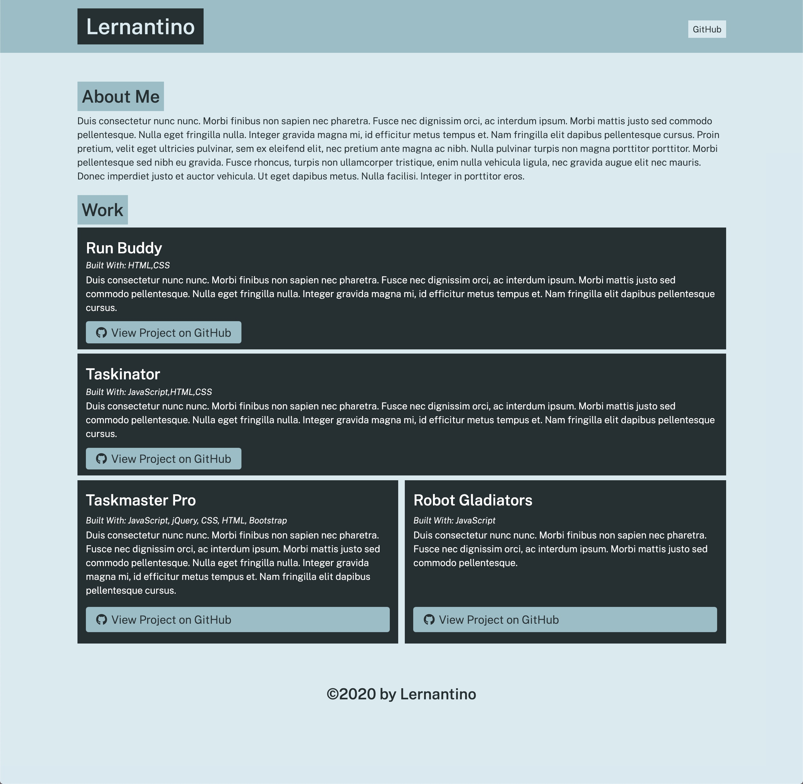

# Portfolio Generator

## Description

Portfolio Generator is a Node.js application that allows the user to generate an application of a portolio, showcasing their GitHub projects.

## Usage

1. Naviage to GitHub repository. Download, install, and run application. 
2. Enter GitHub user information.
3. Enter GitHub project(s) information.

## Screenshot of Application Output

